# 🎯 Goal Tracker App

A modern and responsive **Goal Tracking Web Application** built with React and Material UI.  
This project helps users manage, track, and organize their personal goals efficiently with support for dark/light mode and multi-language (English & Persian).

---

## 🚀 Features

- ➕ Create, edit, and delete goals
- 📊 Track progress of each goal
- 🏷️ Filter goals by category
- 🔍 Search functionality in sidebar
- 🌗 Dark / Light mode support
- 🌍 Multi-language support (EN / FA)
- ⚙️ Settings page for customization
- 💾 Persistent data using LocalStorage
- 📱 Fully responsive UI (Mobile + Desktop)

---

## 🧩 Tech Stack

- React.js
- React Router
- Material UI (MUI)
- i18next (Internationalization)
- LocalStorage API

---

## 🖼️ Screenshots

### 🏠 Dashboard
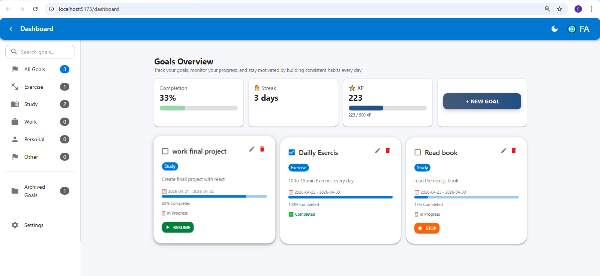

### ⚙️ Add Goal Page
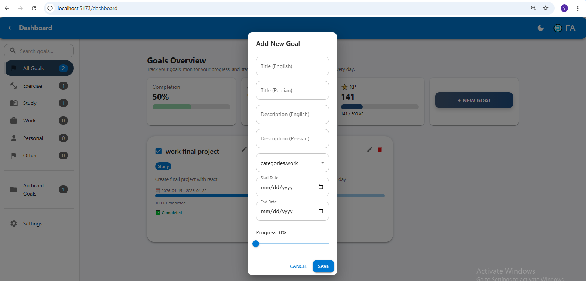

### ⚙️ Edit Goal
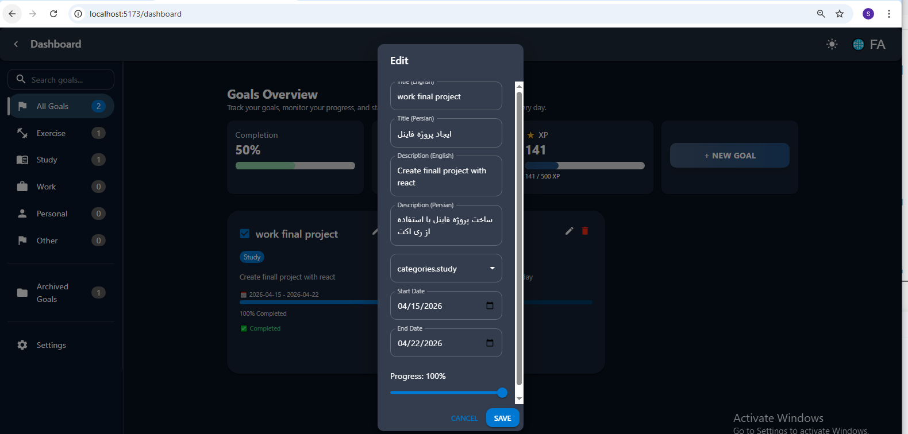

### ⚙️ Delete Goal
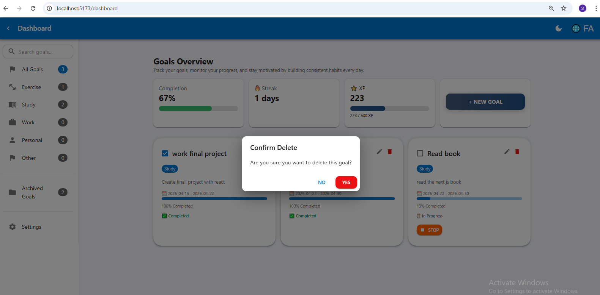

### ⚙️ Detailse
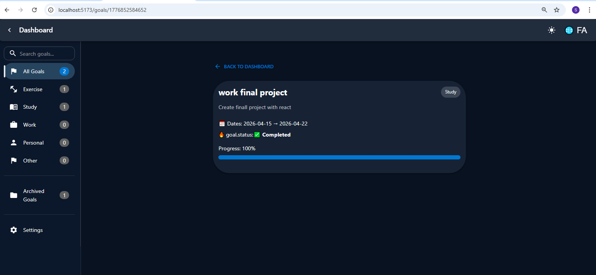

### ⚙️ Filter by categoriy
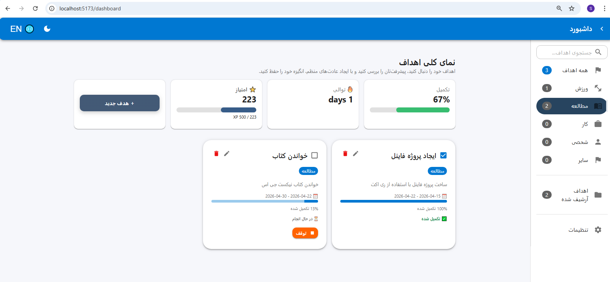

### ⚙️ Not ound Page
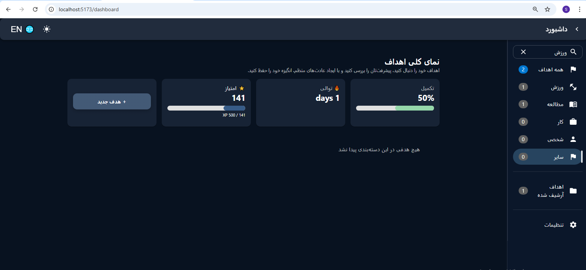

### ⚙️ Search by title/name 
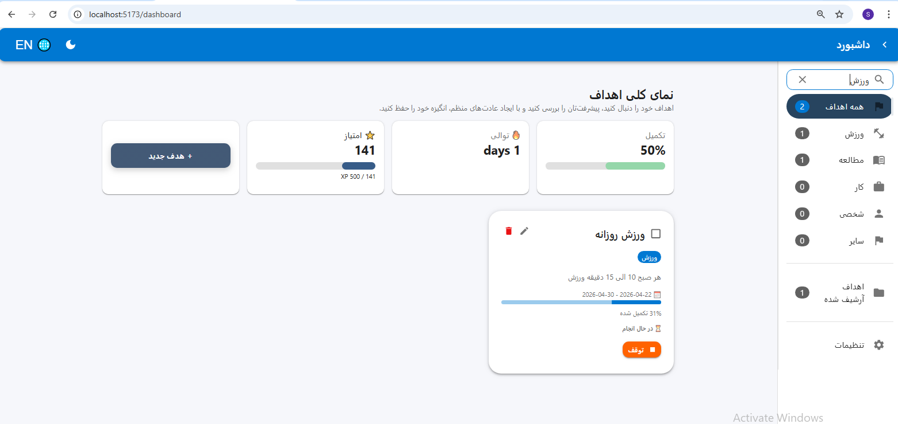

### ⚙️ Archived Goals
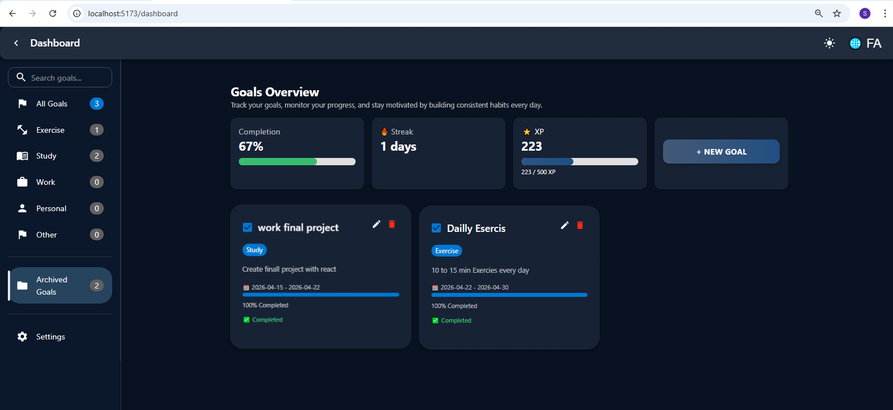

### ⚙️ Settings Page
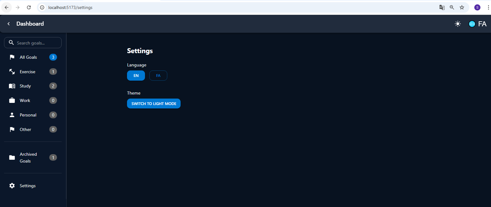

### ⚙️ collapsed sidbar in desktop
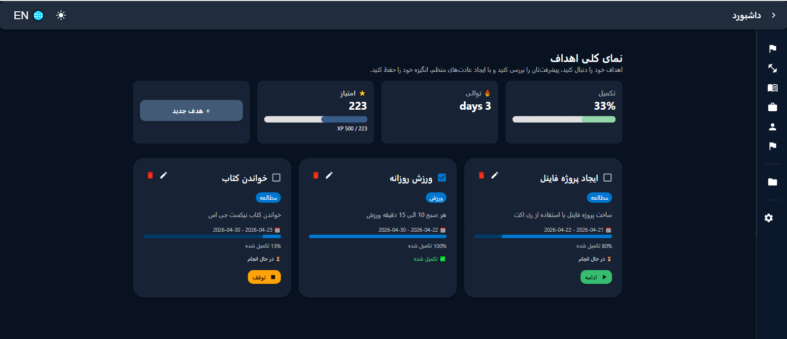

### ⚙️ collapsed driver in mobile
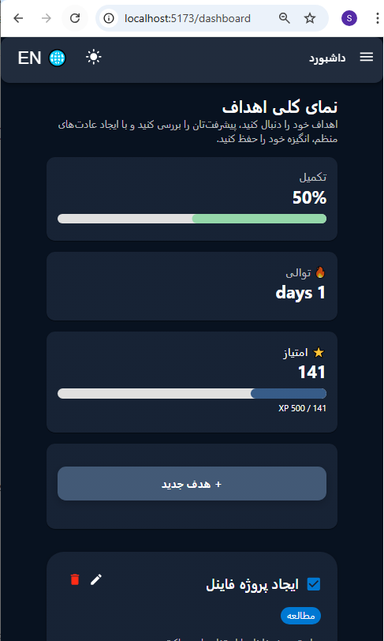

### 📱 Responsive ui
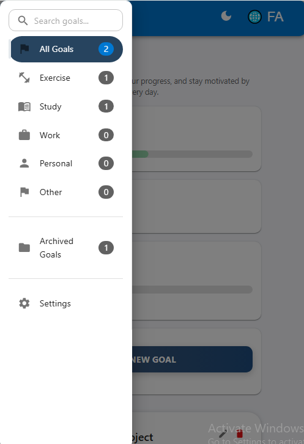

---

## 🌍 Language Support

The app supports two languages:
- English 🇬🇧
- Persian 🇮🇷

Users can switch language from:
- Navbar 🌐 button
- Settings page

---

## 🌗 Theme Support

Users can toggle between:
- Light Mode ☀️
- Dark Mode 🌙

Theme is globally applied using Material UI.

---

## 📂 Project Structure

```bash

- src/
- ├── components/
- │ ├── layout/
- │   ├── layout/
- │   ├── Navbar/
- │   ├── Sidebar/
- │   ├── SummeryCarts/
- ├── context/
- │ ├── SearchContext/
- ├── data/
- │ ├── FormData/
- ├── pages/
- │ ├── Goals/
- │   ├── GoalCard/
- │   ├── GoalForm/
- │   ├── Goals/
- │ ├── ConfirmDeleteDialog/
- │ ├── Dashboard/
- │ ├── GoalDetails/
- │ ├── NotFound/
- │ ├── Settings/
- ├── router/
- │ ├── AppRouter/
- ├── theme/
- │ ├── rtl/
- │ ├── theme/
- ├── utils/
- │ ├── StreakCalcurator/
- │ ├── xpCalculator/
- ├── i18n/
- images/
```

---

## Settings Page

The Settings page includes:

- Language switch (EN / FA)
- Theme toggle (Dark / Light)

All changes apply instantly across the app.

---

## Data Persistence

All goals and settings are saved in **localStorage**, so data remains after refresh.

---

## GitHub Repository

https://github.com/somaiamosadeq1212/product-catalog

---

## Installation & Running

### Navigate into the project folder:

``` bash
cd product-catalog
```

### Install dependencies:

```bash
npm install
```

### Start the development server:

```bash
npm run dev
```

### Open the app in your browser:

```bash
http://localhost:5173
```

## Author
- Somaya Mosadiq
- React Developer